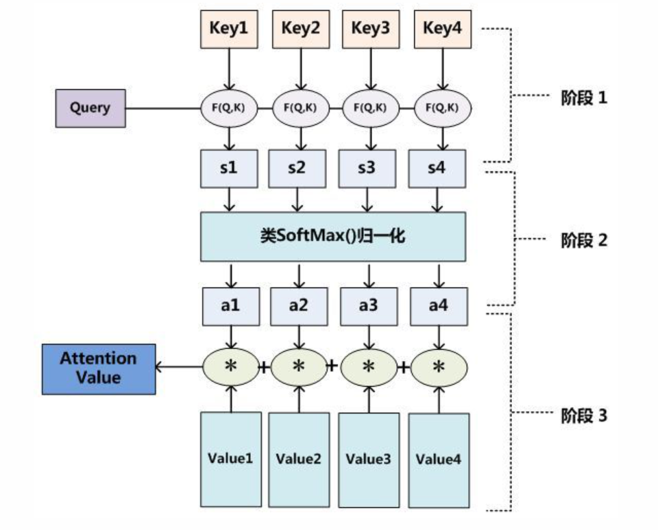
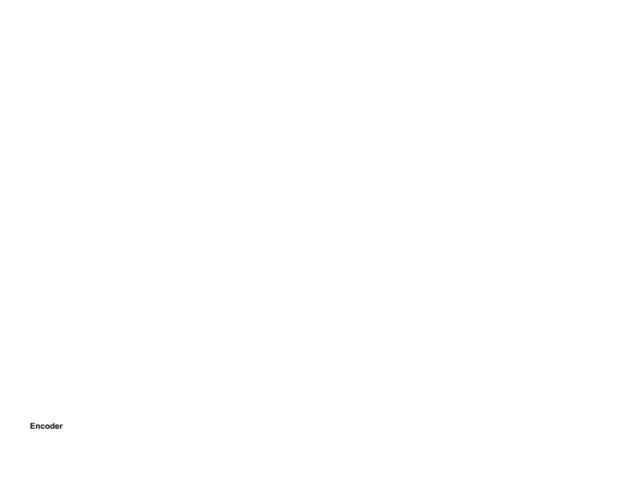
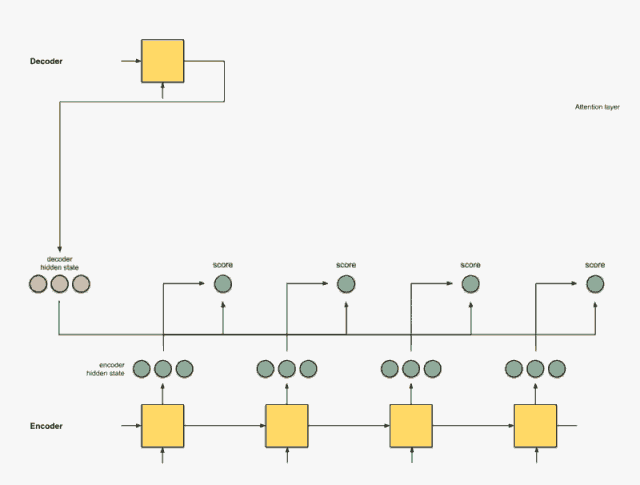
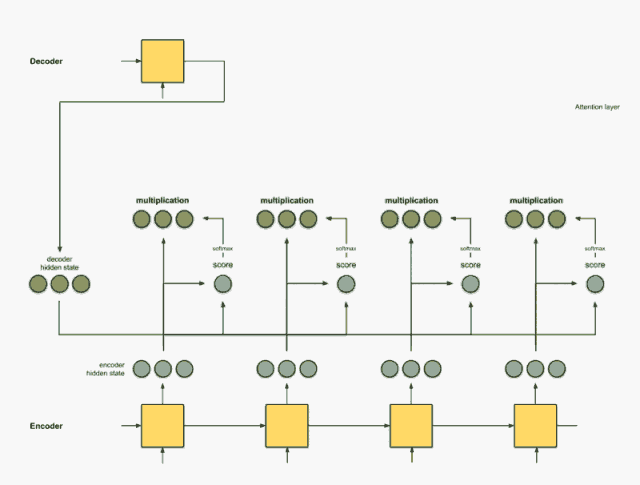

# Attention机制

## 1.Seq2Seq模型

https://www.jianshu.com/p/b2b95f945a98

之所以使用这种模型是因为输出长度不确定,一般在机器翻译中出现

 在网络结构中，输入一个中文序列，然后输出它对应的中文翻译，输出的部分的结果预测后面，根据上面的例子，也就是先输出“machine”，将"machine"作为下一次的输入，接着输出"learning",这样就能输出任意长的序列。
     机器翻译、人机对话、聊天机器人等等，这些都是应用在当今社会都或多或少的运用到了我们这里所说的Seq2Seq。
     举个简单的例子，当我们使用机器翻译时：输入(Hello) --->输出(你好)。再比如在人机对话中，我们问机器：“你是谁？”，机器会返回答案“我是某某某”。如下图所示为一个简单的邮件对话的场景，发送方问：“你明天是否有空”；接收方回答：“有空，怎么了？”。


 seq2seq属于encoder-decoder结构的一种，这里看看常见的encoder-decoder结构，基本思想就是利用两个RNN，一个RNN作为encoder，另一个RNN作为decoder。**encoder负责将输入序列压缩成指定长度的向量**，这个向量就可以看成是这个序列的语义，这个过程称为编码，如下图，**获取语义向量最简单的方式就是直接将最后一个输入的隐状态作为语义向量C**。也可以对最后一个隐含状态做一个变换得到语义向量，还可以将输入序列的所有隐含状态做一个变换得到语义变量。


而**decoder则负责根据语义向量生成指定的序列**，这个过程也称为解码，如下图，最简单的方式是将encoder得到的语义变量作为初始状态输入到decoder的RNN中，得到输出序列。可以看到上一时刻的输出会作为当前时刻的输入，而且其中语义向量C只作为初始状态参与运算，后面的运算都与语义向量C无关。


decoder处理方式还有另外一种，就是语义向量C参与了序列所有时刻的运算，如下图，上一时刻的输出仍然作为当前时刻的输入，但语义向量C会参与所有时刻的运算。

### seq2seq训练

  **RNN是可以学习概率分布，然后进行预测，比如我们输入t时刻的数据后，预测t+1时刻的数据**，比较常见的是字符预测例子或者时间序列预测。为了得到概率分布，一般会在RNN的输出层使用softmax激活函数，就可以得到每个分类的概率。
     Softmax 在机器学习和深度学习中有着非常广泛的应用。尤其在处理多分类（C > 2）问题，分类器最后的输出单元需要Softmax 函数进行数值处理。关于Softmax 函数的定义如下所示：


 其中，是分类器前级输出单元的输出。i 表示类别索引，总的类别个数为C,表示的是当前元素的指数与所有元素指数和的比值。Softmax 将多分类的输出数值转化为相对概率，更容易理解和比较。我们来看下面这个例子。
     一个多分类问题，C = 4。线性分类器模型最后输出层包含了四个输出值，分别是：


 经过Softmax处理后，数值转化为相对概率：


很明显，Softmax 的输出表征了不同类别之间的相对概率。我们可以清晰地看出，S1 = 0.8390，对应的概率最大，则更清晰地可以判断预测为第1类的可能性更大。Softmax 将连续数值转化成相对概率，更有利于我们理解。


对于RNN，对于某个序列，对于时刻t，它的词向量输出概率为$P(x_t|x_1,x_2....x_{t-1})$，则softmax层每个神经元的计算如下：


其中$h^t$是隐含状态，它与上一时刻的状态及当前输入有关，即$ht=f(h_{t-1},x_t)$那么整个序列的概率就为

因为输入也是一个序列所以也是个概率事件


而对于encoder-decoder模型，设有输入序列$x_1....x_T$，输出序列$y_1...y_T$，**输入序列和输出序列的长度可能不同**。那么其实就需要根据输入序列去得到输出序列可能输出的词概率，于是有下面的条件概率，$x_1,x_2,...,x_T$发生的情况下，$y_1,y_2,...,y_T发$生的概率等于$p(y_t|v,y_1,y_2,...,y_{t-1})$连乘，如下公式所示。其中v表示$x_1,x_2,...,x_T$对应的隐含状态向量，它其实可以等同表示输入序列。

$$p(y_1,y_2,...,y_T|x_1,x_2,...,x_T) = \Pi^T_{t=1}p(y_t|x_1,...,x_{t-1},y_1,...,y_{t-1})$$

$$= \Pi^T_{t=1}p(y_t|v,y_1,...,y_t-1)$$


 此时，$h_t = f(h_{t-1},y_{t-1},v)$，decode编码器中隐含状态与上一时刻状态、上一时刻输出和状态v都有关（这里不同于RNN，RNN是与当前时刻的输入相关，而decode编码器是将上一时刻的输出输入到RNN中。于是decoder的某一时刻的概率分布可用下式表示，
$$p(y_t|v,y_1,y_2,...,y_{t-1}) = g(h_t,y_{t-1},v)$$

   所以对于训练样本，我们要做的就是在整个训练样本下，所有样本的$p(y_1,y_2,...,y_T|x_1,...,x_T)$概率之和最大。对应的对数似然条件概率函数为$\frac {1}{N} \Sigma^N_{n=1} log(y_n|x_n,θ)$，使之最大化，θ则是待确定的模型参数。

### seq2seq局限性

Encoder-Decoder 框架虽然应用广泛，但是其存在的局限性也比较大。其最大的局限性就是 Encoder 和 Decoder 之间只通过一个固定长度的语义向量 CC 来唯一联系。也就是说，Encoder 必须要将输入的整个序列的信息都压缩进一个固定长度的向量中，存在两个弊端：一是语义向量 C 可能无法完全表示整个序列的信息；二是先输入到网络的内容携带的信息会被后输入的信息覆盖掉，输入的序列越长，该现象就越严重。这两个弊端使得 Decoder 在解码时一开始就无法获得输入序列最够多的信息，因此导致解码的精确度不够准确。

## 2.Attention机制

https://www.cnblogs.com/ydcode/p/11038064.html

attention机制使用概率对齐,重点关注一部分

在上述的模型中，Encoder-Decoder 框架将输入 XX 都编码转化为语义表示 CC，这就导致翻译出来的序列的每一个字都是同权地考虑了输入中的所有的词。例如输入的英文句子是：`Tom chase Jerry`，目标的翻译结果是：`汤姆追逐杰瑞`。在未考虑注意力机制的模型当中，模型认为 `汤姆` 这个词的翻译受到 `Tom`，`chase` 和 `Jerry` 这三个词的同权重的影响。但是实际上显然不应该是这样处理的，`汤姆` 这个词应该受到输入的 `Tom` 这个词的影响最大，而其它输入的词的影响则应该是非常小的。显然，在未考虑注意力机制的 Encoder-Decoder 模型中，这种不同输入的重要程度并没有体现处理，一般称这样的模型为 **分心模型**。

而带有 Attention 机制的 Encoder-Decoder 模型则是要从序列中学习到每一个元素的重要程度，然后按重要程度将元素合并。因此，注意力机制可以看作是 Encoder 和 Decoder 之间的接口，它向 Decoder 提供来自每个 Encoder 隐藏状态的信息。通过该设置，模型能够选择性地关注输入序列的有用部分，从而学习它们之间的“对齐”。这就表明，在 Encoder 将输入的序列元素进行编码时，得到的不在是一个固定的语义编码 C ，而是存在多个语义编码，且不同的语义编码由不同的序列元素以不同的权重参数组合而成。一个简单地体现 Attention 机制运行的示意图如下：

**定义：对齐**

对齐是指将原文的片段与其对应的译文片段进行匹配。 在下面将会看到利用概率重点关注一部分,先当于是将重点关注的部分与原文进行对其,注意下面的矩阵操作


在 Attention 机制下，语义编码 C 就不在是输入序列 XX 的直接编码了，而是各个元素按其重要程度加权求和得到的，即：
$$
C_i=\sum_{j=0}^{T_x}{a_{ij}f(x_j)}\tag{6}
$$
在公式（6）中，参数 ii表示时刻， jj表示序列中的第 jj个元素， Tx 表示序列的长度， f(⋅) 表示对元素 xj的编码。aij可以看作是一个概率，反映了元素 hj对 Ci的重要性，可以使用 softmax 来表示：
$$
a_{ij}=\frac{exp(e_{ij})}{\sum_{k=1}^{T_x}exp(e_{ik})}\tag{7}
$$


这里 eij正是反映了待编码的元素和其它元素之间的匹配度，当匹配度越高时，说明该元素对其的影响越大，则 aij 的值也就越大。

因此，得出 aij的过程如下图：


其中，hi表示 Encoder 的转换函数，F(hj,Hi)]表示预测与目标的匹配打分函数。将以上过程串联起来，则注意力模型的结构如下图所示：


到目前为止，相信各位客官对 Attention 机制的思想和作用都有了一定的了解。接下来，我们将对 Attention 机制的具体实现原理进行剖析。

Attention 机制的一个重点就是获得 attention value，即机器翻译中的语义编码 Ci。在上一节中我们知道该值是通过输入元素按照不同的权重参数组合而成的，所以我们可以将其定义为一个 attention 函数，比较主流的 attention 函数的机制是采用键值对查询的方式，其工作实质如下图所示：



在自然语言任务中，往往 Key 和 Value 是相同的。需要注意的是，计算出来的 attention value 是一个向量，代表序列元素 xj 的编码向量，包含了元素 xj的上下文关系，即同时包含全局联系和局部联系。全局联系很好理解，因为在计算时考虑了该元素与其他所有元素的相似度计算；而局部联系则是因为在对元素 xj 进行编码时，重点考虑与其相似度较高的局部元素，尤其是其本身。

**Step 0：准备隐藏状态**

首先准备第一个 Decoder 的隐藏层状态（红色）和所有可用的 Encoder 隐藏层状态（绿色）。在示例中，有 4 个 Encoder 隐藏状态和 1 个 Decoder 隐藏状态。



**Step 1：得到每一个 Encoder 隐藏状态的得分**

分值（score）由 `score` 函数来获得，最简单的方法是直接用 Decoder 隐藏状态和 Encoder 中的每一个隐藏状态进行点积。


假设 Decoder 中的隐藏状态为 `[5, 0, 1]`，分别与 Encoder 中的每个隐藏状态做点积，得到第二个隐藏状态的分值最高，说明下一个要解码的元素将受到当前这种隐藏状态的严重影响

```
decoder_hidden = [10, 5, 10]
encoder_hidden score
---------------------
     [0, 1, 1]     15 (= 10×0 + 5×1 + 10×1, the dot product)
     [5, 0, 1]     60
     [1, 1, 0]     15
     [0, 5, 1]     35
```

**Step 2：将所有得分送入 softmax 层**

该部分实质上就是对得到的所有分值进行归一化，这样 `softmax` 之后得到的所有分数相加为 1。而且能够使得原本分值越高的隐藏状态，其对应的概率也越大，从而抑制那些无效或者噪音信息。



通过 softmax 层后，可以得到一组新的隐藏层状态分数，其计算方法即为公式（7）：$a_{ij}=\frac{exp(e_{ij})}{\sum_{k=1}^{T_x}exp(e_{ik})}$ 注意，此处得到的分值应该是浮点数，但是由于无限接近于 0 和 1，所以做了近似。

```
encoder_hidden score score^
-----------------------------
     [0, 1, 1]     15       0
     [5, 0, 1]     60       1
     [1, 1, 0]     15       0
     [0, 5, 1]     35       0
```

**Step 3：用每个 Encoder 的隐藏状态乘以 softmax 之后的得分**

通过将每个编码器的隐藏状态与其softmax之后的分数(标量)相乘，我们得到 对齐向量 或标注向量。这正是对齐产生的机制


加权求和之后可以得到新的一组与 Encoder 隐藏层状态对应的新向量，由于之后第二个隐藏状态的分值为 1 ，而其它的为0，所以得到的新向量也只有第二个向量有效。

```
 encoder score score^ alignment
 ---------------------------------
 [0, 1, 1]   15     0   [0, 0, 0]
 [5, 0, 1]   60     1   [5, 0, 1]
 [1, 1, 0]   15     0   [0, 0, 0]
 [0, 5, 1]   35     0   [0, 0, 0]
```


**Step 4：将所有对齐的向量进行累加**

对对齐向量进行求和，生成 *上下文向量* 。上下文向量是前一步的对齐向量的聚合信息。



该步骤其实就对应了公式（6），得到最终的编码后的向量来作为 Decoder 的输入，其编码后的向量为 `[5, 0, 1]`。

**Step 5：把上下文向量送到 Decoder 中**

通过将上下文向量和 Decoder 的上一个隐藏状态一起送入当前的隐藏状态，从而得到解码后的输出。


最终得到完整的注意力层结构如下图所示：


相比于传统的 RNN 和 CNN，attention 机制具有如下优点：

- 一步到位的全局联系捕捉，且关注了元素的局部联系；attention 函数在计算 attention value 时，是进行序列的每一个元素和其它元素的对比，在这个过程中每一个元素间的距离都是一；而在时间序列 RNNs 中，元素的值是通过一步步递推得到的长期依赖关系获取的，而越长的序列捕捉长期依赖关系的能力就会越弱。
- 并行计算减少模型训练时间；Attention 机制每一步的计算都不依赖于上一步的计算结果，因此可以并行处理。
- 模型复杂度小，参数少

但 **attention 机制的缺点也比较明显，因为是对序列的所有元素并行处理的，所以无法考虑输入序列的元素顺序，这在自然语言处理任务中比较糟糕。因为在自然语言中，语言的顺序是包含了十分多的信息的，**