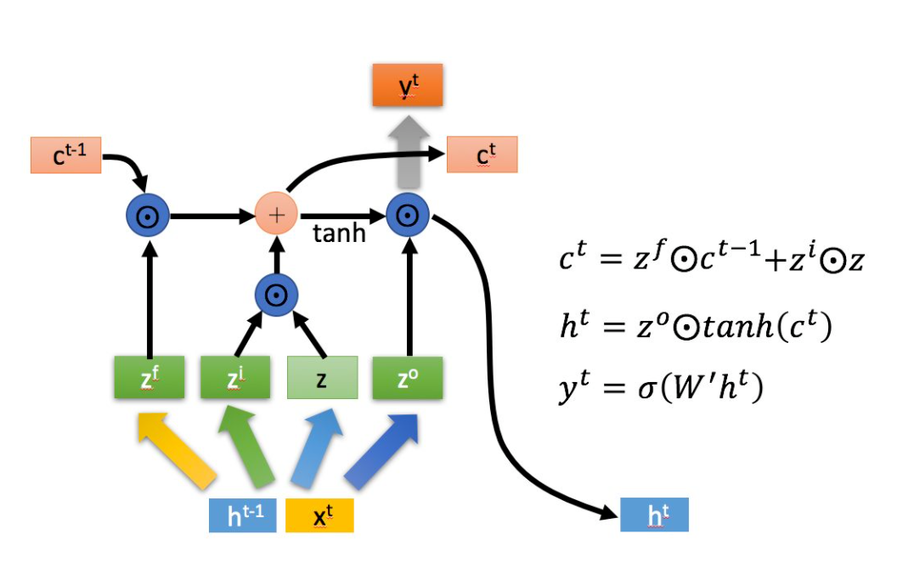
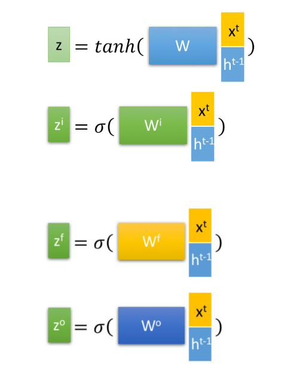

# LSTM

lstm主要是解决RNN在长序列训练过程中出现的梯度爆炸和梯度消失的问题

LSTM主要由3个门控组成,他们分别是,遗忘门,输入门,输出门,LSTM长这个样子

首先明确LSTM利用上一个阶段的$h^t$和本阶段$x^t$进行4中运算

其中$z^i,z^f,z^o$是门的三个选择参数,他们通过拼接向量$x^t$与$h^{t-1}$乘以权重矩阵得到的,最上面那个是本次细胞 的输入,之所以选用tanh就是因为他是一个输入.

但也因为引入了很多内容，导致参数变多，也使得训练难度加大了很多。因此很多时候我们往往会使用效果和LSTM相当但参数更少的GRU来构建大训练量的模型。

LSTM内部主要有三个阶段：

1. 忘记阶段。这个阶段主要是对上一个节点传进来的输入进行**选择性**忘记。简单来说就是会 “忘记不重要的，记住重要的”。

具体来说是通过计算得到的 $z^f$（f表示forget）来作为忘记门控，来控制上一个状态的 $C^{t-1}$哪些需要留哪些需要忘。

2. 选择记忆阶段。这个阶段将这个阶段的输入有选择性地进行“记忆”。主要是会对输入 $x^t$进行选择记忆。哪些重要则着重记录下来，哪些不重要，则少记一些。当前的输入内容由前面计算得到的 $z$表示。而选择的门控信号则是由 $z^i$（i代表information）来进行控制。

> 将上面两步得到的结果相加，即可得到传输给下一个状态的 $c^t$ 。也就是上图中的第一个公式。

3. 输出阶段。这个阶段将决定哪些将会被当成当前状态的输出。主要是通过$z^o$来进行控制的。并且还对上一阶段得到的 $c^o$进行了放缩（通过一个tanh激活函数进行变化）。

与普通RNN类似，输出 $y^t$往往最终也是通过 $h^t$变化得到。