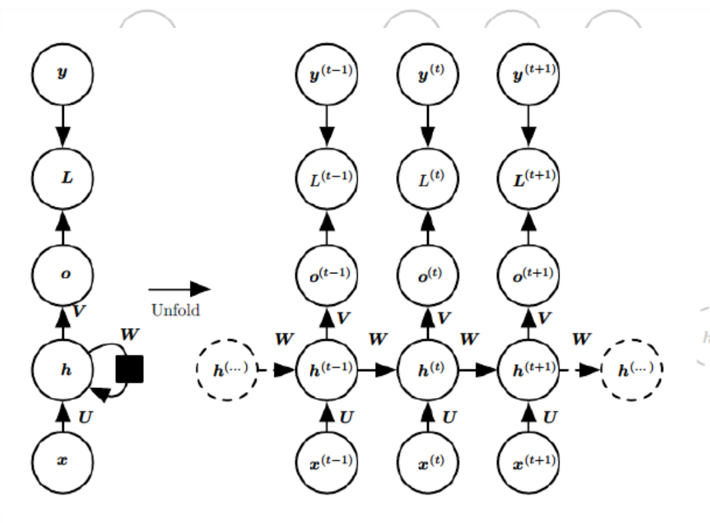
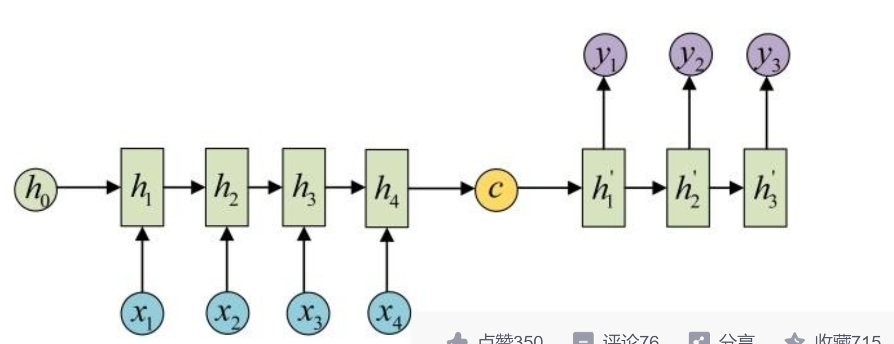
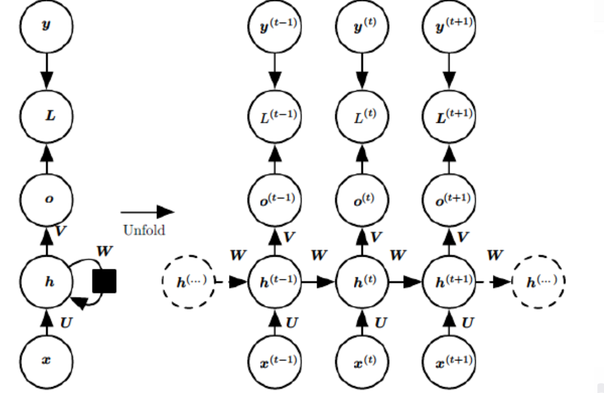
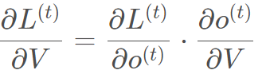
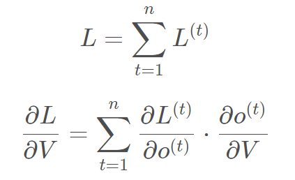
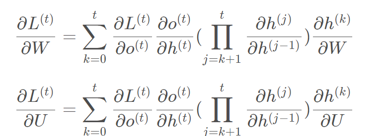
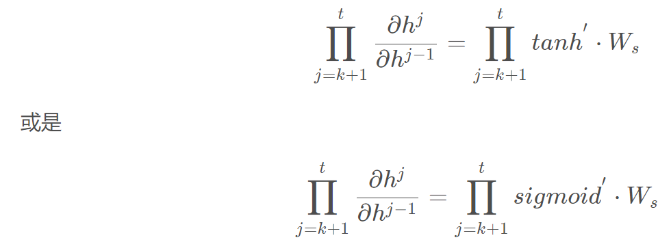
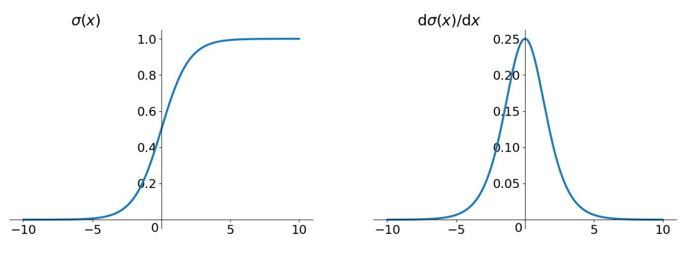
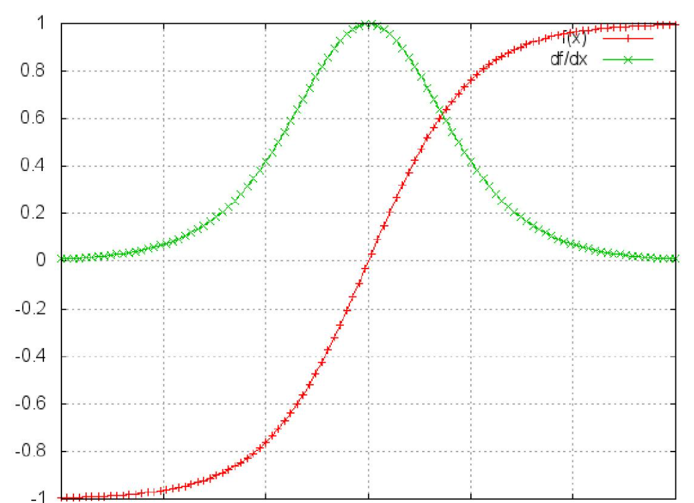
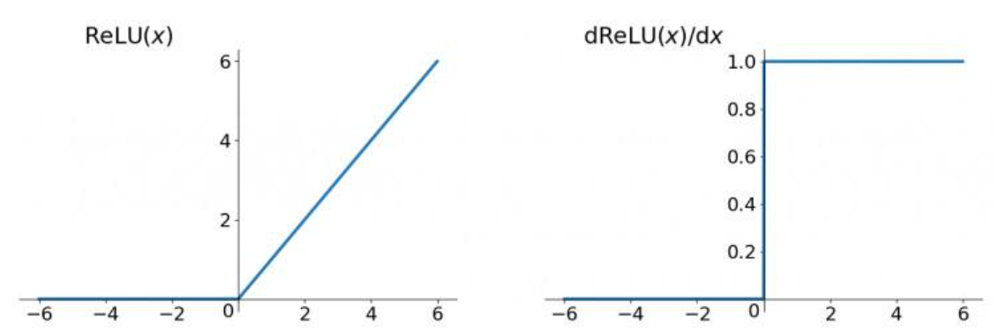

# RNN 

[TOC]

## 1.N-gram

https://zhuanlan.zhihu.com/p/32829048

N-Gram是一种基于统计语言模型的算法。它的基本思想是将文本里面的内容按照字节进行大小为N的滑动窗口操作，形成了长度是N的字节片段序列。

每一个字节片段称为gram，对所有gram的出现频度进行统计，并且按照事先设定好的阈值进行过滤，形成关键gram列表，也就是这个文本的向量特征空间，列表中的每一种gram就是一个特征向量维度。

该模型基于这样一种假设，第N个词的出现只与前面N-1个词相关，而与其它任何词都不相关，整句的概率就是各个词出现概率的乘积。这些概率可以通过直接从语料中统计N个词同时出现的次数得到。常用的是二元的Bi-Gram和三元的Tri-Gram。

### 2. N-gram的应用

#### n-gram用于评估语句是否合理

如果有一个m个词组成的序列，我们希望得到概率$p(w_1...w_m)$,根据链式规则可以得到
$$
p(w_1....w_m)=P(w_1)*p(w_2|w_1)*p(w3|w_1,w_2)....p(w_m|w_1...,w_{m-1})
$$

但是这个链式的公式并不好计算，所以使用马尔可夫链假设，当前这个词只与跟前几个词有关，这样可以大幅度缩减链式的长度，
$$
p(w_1....w_m)=p(w_i|p_{w-n+1}...w_-1)
$$
通过大量尝试发现n=1,2,3之后发现是可以的

当n=1的时候，一元模型（unigram model）(全部乘以先验概率)
$$
P(w_1,w_2...w_m)=\prod P(w_i)
$$
当n=2的时候(bigram model)
$$
P(w_1,w_2...w_m)=\prod P(w_i|w_{i-1})
$$
当n=3的时候为三元模型（trigram model）
$$
P(w_1,w_2...w_m)=\prod P(w_i|w_{i-1},w_{i-2})
$$

然后利用贝叶斯公式

对于bigram而言
$$
P(w_i|w_{i-1})=\frac{C(W_{i-1}w_i)}{C(w_{i_1})}
$$
对于n-gram而言
$$
P(w_i|w_{i-n+1},..w_{i-1})=\frac{C(w_{i-n-1},....w_i)}{C(w_{i-n-1},..w_{i-1})}
$$
对上面biggram进行解释
$$
p(w_i|w_{i-1})=\frac{p(w_i,w_{i-1})}{p(w_{i-1})}=\frac{count(w_i,w_{i-1})/count(allword)}{count(w_{i-1})/count(allword)}=\frac{count(w_i,w_{i-1})}{count(w_{i-1})}
$$
具体例子见https://zhuanlan.zhihu.com/p/32829048 下面

## 2. N 的大小对性能的影响

- ***n更大的时候\***
  n: 对下一个词出现的约束性信息更多，更大的辨别力，但是更稀疏，并且n-gram的总数也更多，为 ![[公式]](https://www.zhihu.com/equation?tex=V%5En) 个（V为词汇表的大小）
- ***n更小的时候\***
- 在训练语料库中出现的次数更多，更可靠的统计结果，更高的可靠性 ，但是约束信息更少

## 3.贝叶斯定理

https://blog.csdn.net/jiangjiang_jian/article/details/81346797

$$
P(A|B)=\frac{P(B|A)*P(A)}{P(B)}
$$
上面的式子被称为贝叶斯公式，贝叶斯公式推导

贝叶斯公式就是标准相似度*先验概率

P（A）因为没有其他事件的牵涉所以叫做先验概率，P(A|B)因为有B事件的牵涉所以被称为后验概率,贝叶斯公式就是来利用其他三个

通常，事件 A 在事件 B 发生的条件下的概率，与事件 B 在事件 A 发生的条件下的概率是不一样的；然而，这两者是有确定关系的，贝叶斯定理就是这种关系的陈述。

贝叶斯公式的用途在于通过己知三个概率来推测第四个概率。它的内容是：在 B 出现的前提下，A 出现的概率等于 A 出现的前提下 B 出现的概率乘以 A 出现的概率再除以 B 出现的概率。通过联系 A 与 B，计算从一个事件发生的情况下另一事件发生的概率，即从结果上溯到源头（也即逆向概率）。

**通俗地讲就是当你不能确定某一个事件发生的概率时，你可以依靠与该事件本质属性相关的事件发生的概率去推测该事件发生的概率**。用数学语言表达就是：支持某项属性的事件发生得愈多，则该事件发生的的可能性就愈大。这个推理过程有时候也叫贝叶斯推理。

## 4.RNN与n-gram

RNN与n-gram都可以用来做填空即预测下一个词，但是n-gram只看到近邻的几个词，前面丢失了一些东西，当然可以加大n，但是加大n的代价就是模型会占用海量的存储空间，这时候就产生了RNN(RNN理论上可以看到前后任意多个词)https://zybuluo.com/hanbingtao/note/541458

## 5. RNN 过程

链接

https://blog.csdn.net/zhaojc1995/article/details/80572098

上图就是RNN的结构和展开图，RNN的权值W,U,V是共享的，y为标签，L为损失，其中损失也是随时间进行累积的，

RNN有许多的变体结构，1vs1,1vs n,n vs 1等

原始的N vs N 模型要求序列等长，但是遇到的大部分问题并不是序列等长的，如机器翻译中源语言和目标语言未必等长。为了解决这种问题出现了seq2seq模型，即N　vs M 又被称为Encoder - Decoder模型。 

## 6.标准RNN前向推导

t时刻对于前向传播算法
$$
h^(t)=f(Ux^t+Wh^{t-1}+b)
$$
其中f为激活函数,一般为tanh,为什么下面会说

输出为
$$
o(^t)=Vh^(t)+c
$$
最终
$$
\hat{y}^{(t)}=\sigma^{(t)}
$$
$\sigma$为激活函数,通常RNN用与分类,一般为softmax

## 反向传播BPTT

BPTT（back-propagation through time）算法是常用的训练RNN的方法，其实本质还是BP算法，只不过RNN处理时间序列数据，所以要基于时间反向传播，故叫随时间反向传播。BPTT的中心思想和BP算法相同，沿着需要优化的参数的负梯度方向不断寻找更优的点直至收敛。综上所述，BPTT算法本质还是BP算法，BP算法本质还是梯度下降法，那么求各个参数的梯度便成了此算法的核心。

V的偏导

这个式子看起来简单但是求解起来很容易出错，因为其中嵌套着激活函数函数，是复合函数的求道过程。

RNN的损失也是会随着时间累加的，所以不能只求t时刻的偏导。

W和U的偏导的求解由于需要涉及到历史数据，其偏导求起来相对复杂，我们先假设只有三个时刻，那么**在第三个时刻** L对W的偏导数为

可以观察到，在某个时刻的对W或是U的偏导数，需要追溯这个时刻之前所有时刻的信息，这还仅仅是一个时刻的偏导数，上面说过损失也是会累加的，那么整个损失函数对W和U的偏导数将会非常繁琐。虽然如此但好在规律还是有迹可循，我们根据上面两个式子可以写出L在t时刻对W和U偏导数的通式：

整体的偏导公式就是将其按时刻再一一加起来。

前面说过激活函数是嵌套在里面的，如果我们把激活函数放进去，拿出中间累乘的那部分：

我们会发现累乘会导致激活函数导数的累乘，进而会导致“**梯度消失**“和“**梯度爆炸**“现象的发生。

至于为什么，我们先来看看这两个激活函数的图像。
这是sigmoid函数的函数图和导数图。

这是tanh函数的函数图和导数图。

它们二者是何其的相似，都把输出压缩在了一个范围之内。他们的导数图像也非常相近，我们可以从中观察到，sigmoid函数的导数范围是(0,0.25]，tanh函数的导数范围是(0,1]，他们的导数最大都不大于1。

这就会导致一个问题，在上面式子累乘的过程中，如果取sigmoid函数作为激活函数的话，那么必然是一堆小数在做乘法，结果就是越乘越小。随着时间序列的不断深入，小数的累乘就会导致梯度越来越小直到接近于0，这就是“梯度消失“现象。其实RNN的时间序列与深层神经网络很像，在较为深层的神经网络中使用sigmoid函数做激活函数也会导致反向传播时梯度消失，梯度消失就意味消失那一层的参数再也不更新，那么那一层隐层就变成了单纯的映射层，毫无意义了，所以在深层神经网络中，有时候多加神经元数量可能会比多家深度好。

你可能会提出异议，RNN明明与深层神经网络不同，RNN的参数都是共享的，而且某时刻的梯度是此时刻和之前时刻的累加，即使传不到最深处那浅层也是有梯度的。这当然是对的，但如果我们根据**有限层**的梯度来更新**更多层的共享的参数**一定会出现问题的，因为将有限的信息来作为寻优根据必定不会找到所有信息的最优解。

之前说过我们多用tanh函数作为激活函数，那tanh函数的导数最大也才1啊，而且又不可能所有值都取到1，那相当于还是一堆小数在累乘，还是会出现“梯度消失“，那为什么还要用它做激活函数呢？原因是tanh函数相对于sigmoid函数来说梯度较大，收敛速度更快且引起梯度消失更慢。

还有一个原因是sigmoid函数还有一个缺点，Sigmoid函数输出不是零中心对称。sigmoid的输出均大于0，这就使得输出不是0均值，称为偏移现象，这将导致后一层的神经元将上一层输出的非0均值的信号作为输入。关于原点对称的输入和中心对称的输出，网络会收敛地更好。

RNN的特点本来就是能“追根溯源“利用历史数据，现在告诉我可利用的历史数据竟然是有限的，这就令人非常难受，解决“梯度消失“是非常必要的。这里说两种改善“梯度消失”的方法：
1、选取更好的激活函数
2、改变传播结构

关于第一点，一般选用ReLU函数作为激活函数，ReLU函数的图像为：

ReLU函数的左侧导数为0，右侧导数恒为1，这就避免了小数的连乘，但反向传播中仍有权值的累乘，所以说ReLU函数不能说完全解决了“梯度消失”现象，只能说改善。有研究表明，在RNN中使用ReLU函数配合将权值初始化到单位矩阵附近，可以达到接近LSTM网络的效果。但恒为1的导数容易导致“梯度爆炸“，但设定合适的阈值可以解决这个问题。还有一点就是如果左侧横为0的导数有可能导致把神经元学死，不过设置合适的步长（学习率）也可以有效避免这个问题的发生。

关于第二点，LSTM结构就是传统RNN的改善。

总结一下，sigmoid函数的缺点：
1、导数值范围为(0,0.25]，反向传播时会导致“梯度消失“。tanh函数导数值范围更大，相对好一点。
2、sigmoid函数不是0中心对称，tanh函数是，可以使网络收敛的更好。